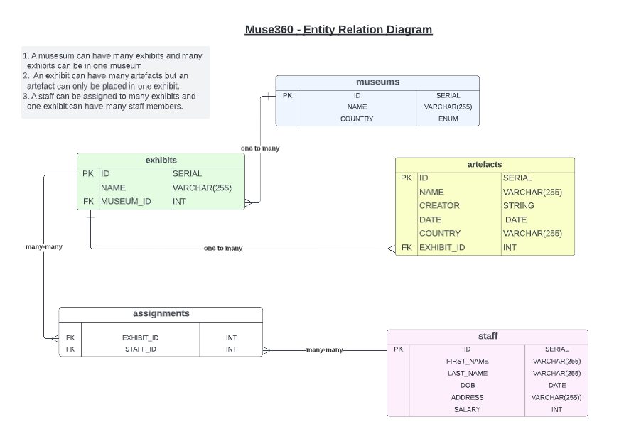

# Muse360

The globe at your fingertips

Ana Bela, James, Falak, Maisha

## Project Description

Muse360: A Museum management API to help museums manage their exhibits, artefacts and staff rotas. Using Java, Spring and H2 console database.

Database consists of:

- Museums
- Exhibits
- Artefacts
- Staff
- Assignments

### UML Diagram

### Entity Relation Diagram

## Setup Instructions

    1. Fork the Repository
    2. Clone your forked Repository: git clone 
    3. Open IntelliJ
    4. Code away!

## Usage

#### Table of HTTP Request Paths

localhost:8080/ ...

| HTTP Request Path                              | Request Type | Description                             |
|:-----------------------------------------------|:-------------|:----------------------------------------|
| MUSEUM                                         |              |                                         |
| `.../museum `                                  | `GET`        | Get all museums                         |
| `.../museum/{id}`                              | `GET`        | Get museum by id                        |
| `.../museum/create`                            | `POST`       | Add a new museum                        |
| `.../museum/{museum_id}/exhibit/{exhibit_id} ` | `PUT`        | Add an exhibit to a museum              |
| `.../museum/delete/{id}`                       | `DElETE`     | Delete a museum                         |
| EXHIBIT                                        |              |                                         |
| `.../exhibit `                                 | `GET`        | Get all exhibits                        |
| `.../exhibit/{id} `                            | `GET`        | Get exhibit by id                       |
| `.../exhibit/create`                           | `POST`       | Add a new exhibit                       |
| `.../exhibit/update/{id} `                     | `PUT`        | Update an exhibit                       |
| `.../exhibit/delete/{id} `                     | `DELETE`     | Delete an exhibit                       |
| ARTEFACT                                       |              |                                         |
| `.../artefact `                                | `GET`        | Get all artefacts                       |
| `.../artefact/byExhibit/{id} `                 | `GET`        | Get artefacts by exhibit id             |
| `.../artefact/{country}`                       | `GET`        | Get artefacts by country                |
| `.../artefact/create `                         | `POST`       | Add a new artefact                      |
| `.../artefact/update/{id} `                    | `PUT`        | Update an artefact                      |
| `.../artefact/delete/{id}`                     | `DELETE`     | Delete an artefact                      |
| STAFF                                          |              |                                         |
| `.../staff `                                   | `GET`        | Get all staff                           |
| `.../staff/{id}`                               | `GET`        | Get staff by id                         |
| `.../staff/hire`                               | `POST`       | Hire a new staff member                 |
| `.../staff/{staff_id}/exhibit/{exhibit_id} `   | `PUT`        | Assign a new staff member to an exhibit |
| `.../staff/fire/{id}`                          | `DElETE`     | Fire a staff member                     |

## Acknowledgements

- [Ana Bela Lima] (https://github.com/anabela-lima)
- [James Stilman] (https://github.com/JStillman1)
- [Falak ] (https://github.com/Falakhan)
- [Maisha Islam] (https://github.com/maisha-i)

